

# 🏛️ PRISM — Enterprise System Architecture & Technical Specification
### *Predictive Risk & Infrastructure Status Monitoring Platform*
#### **Authoritative Technical Design Document · Smart India Hackathon 2026**

 

**PRISM** is a national-scale predictive intelligence and infrastructure governance platform designed for the **Ministry of Statistics and Programme Implementation (MoSPI)** and central project authorities. It transforms static, lagging monthly Flash Reports into dynamic, explainable early warning forecasts, automated intervention workflows, and geospatial decision intelligence across **₹42.78+ Lakh Crore** of central sector capital expenditure.

---

## 📑 Table of Contents

1. [High-Level System Topology (Macro Architecture)](#1-high-level-system-topology-macro-architecture)
2. [Data Ingestion & Ephemeral Parsing Pipeline](#2-data-ingestion--ephemeral-parsing-pipeline)
3. [Dual-Engine Machine Learning & TreeSHAP Inference Engine](#3-dual-engine-machine-learning--treeshap-inference-engine)
4. [Early Warning & Dynamic S-Curve Assessment Engine](#4-early-warning--dynamic-s-curve-assessment-engine)
5. [Intelligent Document Processing & Authenticity Pipeline](#5-intelligent-document-processing--authenticity-pipeline)
6. [Intervention Action Management & Governance State Machine](#6-intervention-action-management--governance-state-machine)
7. [Citizen Ground Evidence & Fraud Detection Triangulation](#7-citizen-ground-evidence--fraud-detection-triangulation)
8. [Role-Based Access Control (RBAC) & Security Architecture](#8-role-based-access-control-rbac--security-architecture)
9. [Database Entity Relationship Diagram (ERD)](#9-database-entity-relationship-diagram-erd)
10. [National Digital Ecosystem & Interoperability Gateway](#10-national-digital-ecosystem--interoperability-gateway)
11. [Performance, Resilience & High-Availability Architecture](#11-performance-resilience--high-availability-architecture)

---

## 1. High-Level System Topology (Macro Architecture)

PRISM is engineered on a modern, decoupled **n-tier reactive architecture** combining a high-performance **Next.js 16 (Turbopack, App Router)** presentation tier with an asynchronous **FastAPI ASGI** microservices backend, powered by a dual XGBoost predictive core and dual database persistence (PostgreSQL with PgBouncer pooling + SQLite offline edge replica).

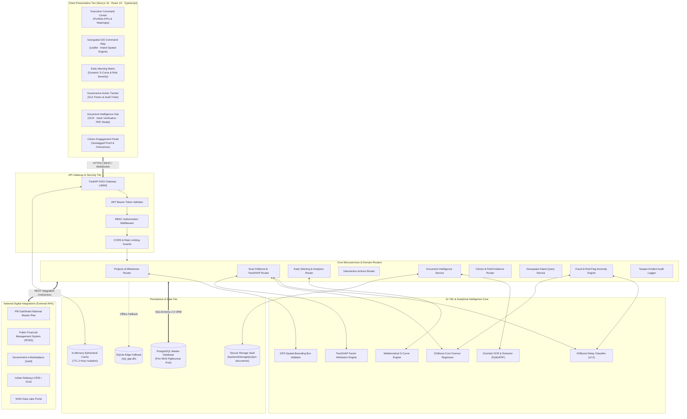

---

## 2. Data Ingestion & Ephemeral Parsing Pipeline

PRISM processes official MoSPI monthly Flash Reports (multi-hundred page unstructured PDFs, e.g. 160+ pages) without database contamination using an **Autonomous Ephemeral Extraction Pipeline**.

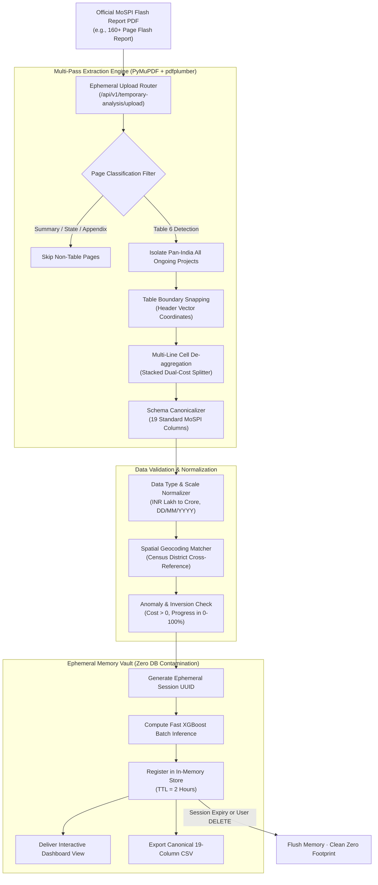

> [!IMPORTANT]
> **Zero Database Contamination Guarantee**: Ephemeral ingestion executes completely within volatile session memory. Ad-hoc report uploads, testing files, and draft minister briefings can be simulated without writing unverified rows into the master database.

---

## 3. Dual-Engine Machine Learning & TreeSHAP Inference Engine

PRISM replaces opaque heuristic guesswork with an explainable, dual-model machine learning pipeline built on **XGBoost 2.0+** and **TreeSHAP (Tree-based Shapley Additive Explanations)**.

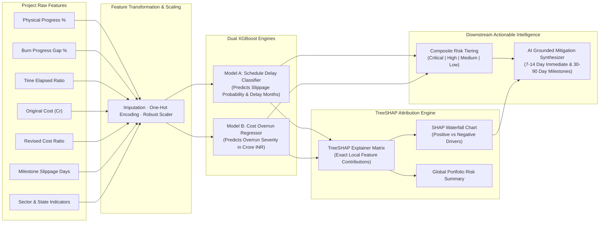

### Mathematical Formulation of Dual Prediction & SHAP
The composite predictive risk score $\mathcal{R}_{\text{comp}} \in [0, 1]$ is computed as:

$$\mathcal{R}_{\text{comp}} = w_{\text{delay}} \cdot P(\text{Delay}) + w_{\text{cost}} \cdot \min\left(1.0, \frac{\Delta \text{Cost}}{\text{Sanctioned Cost}}\right)$$

Where $w_{\text{delay}} = 0.55$ and $w_{\text{cost}} = 0.45$. TreeSHAP evaluates exact additive attributions $\phi_i$:

$$f(x) = \phi_0 + \sum_{i=1}^{M} \phi_i(x)$$

---

## 4. Early Warning & Dynamic S-Curve Assessment Engine

The Early Warning System dynamically evaluates construction cadence against an analytical logistic S-curve, detecting early operational deterioration before official schedule targets slip.

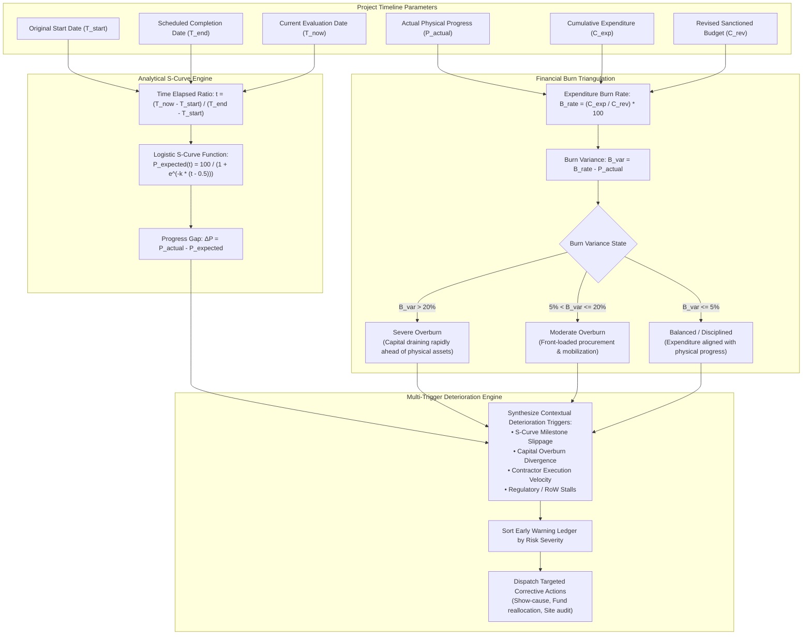

---

## 5. Intelligent Document Processing & Authenticity Pipeline

PRISM features an enterprise document management and verification system for Detailed Project Reports (DPR), monthly monitoring reports, contractor bills, and site inspection certificates.

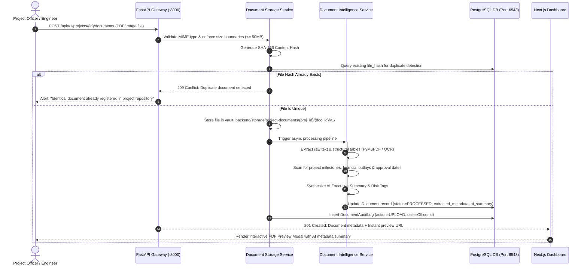

---

## 6. Intervention Action Management & Governance State Machine

Remediation workflows follow a strict **tamper-evident state machine** with role-enforced transitions, supervisory approvals, and audit trail logging.

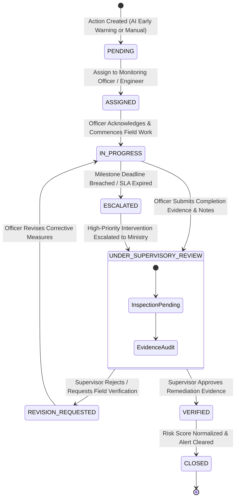

> [!TIP]
> **Tamper-Evident History**: Every state change, reassignment, priority modification, and review note is immutably appended to the `intervention_action_history` table with UTC timestamp and officer credentials.

---

## 7. Citizen Ground Evidence & Fraud Detection Triangulation

PRISM bridges public transparency with automated fraud prevention by triangulating contractor progress claims against geotagged citizen submissions.

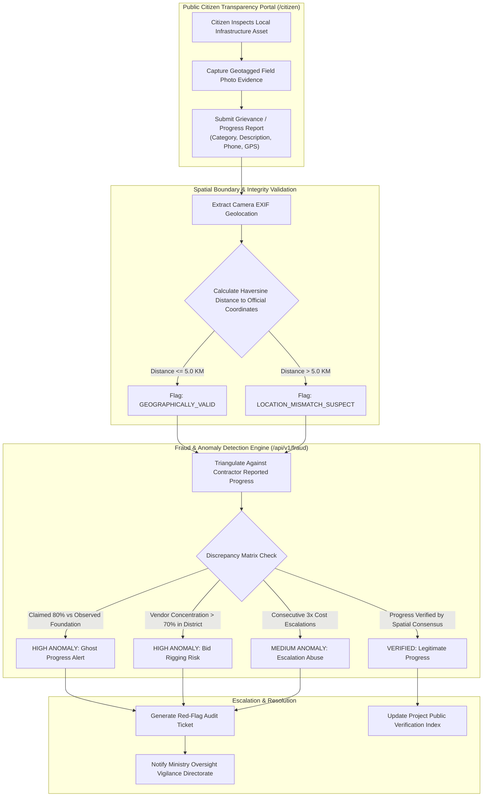

---

## 8. Role-Based Access Control (RBAC) & Security Architecture

PRISM enforces strict principle-of-least-privilege access using cryptographically signed **JWT tokens** and hierarchical role permission guards.

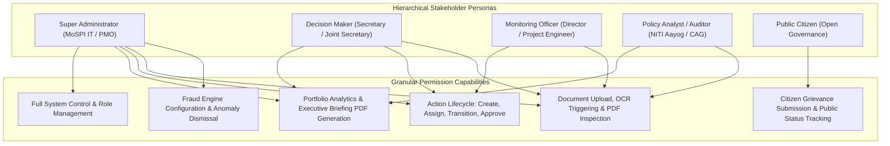

### Permission Guard Matrix

| Role | Command Center | Geospatial GIS | Early Warning | Action Lifecycle | Doc Management | Fraud Alerts | User Admin |
|:---|:---:|:---:|:---:|:---:|:---:|:---:|:---:|
| **Super Admin** | 🟢 Read/Write | 🟢 Full Access | 🟢 Full Access | 🟢 Full Access | 🟢 Full Access | 🟢 Full Access | 🟢 Manage All |
| **Decision Maker** | 🟢 Read/Write | 🟢 Full Access | 🟢 Full Access | 🟢 Approve/Close | 🟢 View/Download | 🟢 Review Flags | 🔴 Read Only |
| **Monitoring Officer** | 🟢 Read Only | 🟢 Sector GIS | 🟢 Operational | 🟢 Update/Submit | 🟢 Upload/View | 🟡 View Project | 🔴 Restricted |
| **Policy Analyst** | 🟢 Read Only | 🟢 Spatial Read | 🟢 Analytical | 🟡 View Only | 🟢 View Only | 🟡 View Metrics | 🔴 Restricted |
| **Public Citizen** | 🔴 Restricted | 🟡 Public Map | 🔴 Restricted | 🔴 Restricted | 🔴 Restricted | 🔴 Restricted | 🔴 Restricted |

---

## 9. Database Entity Relationship Diagram (ERD)

The persistence layer uses a high-performance relational schema with UUID primary keys, JSONB polymorphic payloads, and cascade safety constraints.

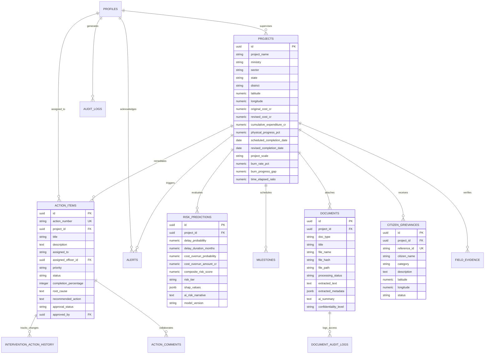

---

## 10. National Digital Ecosystem & Interoperability Gateway

PRISM functions as the central analytical nucleus interconnecting diverse national government portals through standard RESTful JSON integrations.

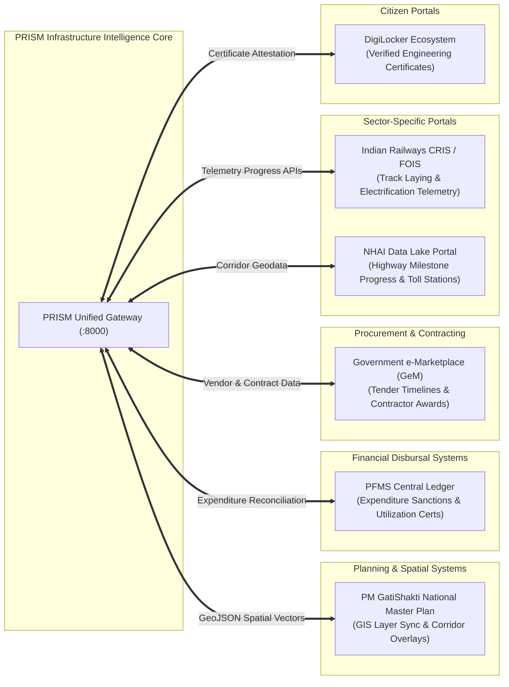

---

## 11. Performance, Resilience & High-Availability Architecture

To support uninterrupted nationwide monitoring during emergency reviews and cabinet meetings, PRISM implements enterprise fault tolerance:

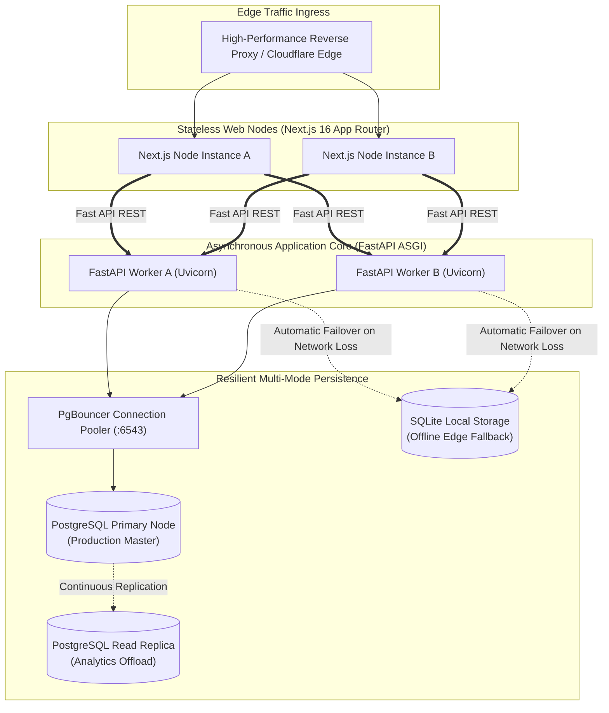

### Resilience Guarantees
1. **Offline Edge Resilience**: If PostgreSQL network connectivity is disrupted, the backend gracefully switches to local `sql_app.db` SQLite storage, ensuring zero downtime for field officers.
2. **Connection Starvation Prevention**: PgBouncer transaction pooling prevents PostgreSQL connection exhaustion during concurrent portfolio scans across 1,981+ assets.
3. **Sub-40 Millisecond API Response**: Optimized database indexing on `(state, sector, risk_tier)` and lightweight Pydantic v2 schemas deliver sub-40ms response times for virtualized tables.

---

  Engineered with precision for National Infrastructure Intelligence · Smart India Hackathon 2026
   
  Official Repository: <a href="https://github.com/vedant1506/SIH-26">vedant1506/SIH-26</a>

