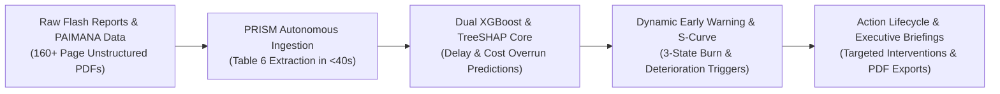
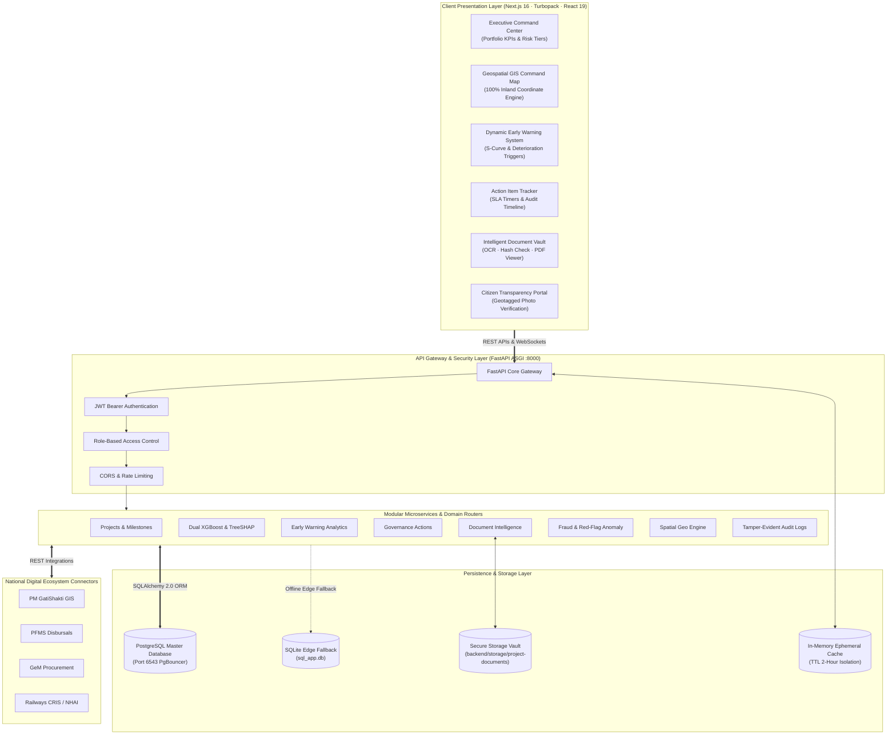

<div align="center">

# ⚡ PRISM: Predictive Risk & Infrastructure Status Monitoring
### *Next-Generation AI Intelligence & Geospatial Analytics Platform for National Infrastructure*
#### **Smart India Hackathon 2026 (SIH26103) · Ministry of Statistics and Programme Implementation (MoSPI)**

[-black?style=for-the-badge&logo=next.js)](https://nextjs.org/)
[](https://react.dev/)
[](https://fastapi.tiangolo.com/)
[](https://python.org/)
[](https://xgboost.readthedocs.io/)
[](https://github.com/slundberg/shap)
[](https://leafletjs.com/)
[](ARCHITECTURE.md)

<br />

**PRISM** is an enterprise-grade infrastructure intelligence and project governance platform engineered for central ministries, state project monitoring units, and project authorities across India. It ingests official **MoSPI PAIMANA** datasets and monthly **Flash Reports**, transforming fragmented oversight into **explainable predictive risk forecasts**, **dynamic S-curve early warnings**, **TreeSHAP root-cause attributions**, **high-precision geospatial mapping**, **intelligent document lifecycle verification**, and **automated executive mitigation roadmaps** across **₹42.78+ Lakh Crore** of capital assets.

[🏛️ Executive Summary](#-executive-summary) • [📐 System Architecture](#-system-architecture) • [🚀 Core Platform Modules](#-core-platform-modules) • [📈 Demonstration Portfolio](#-live-demonstration-portfolio) • [🏁 Quick Start](#-quick-start) • [🔌 API Directory](#-api-directory) • [📑 Full Architecture Doc](ARCHITECTURE.md)

</div>

---

## 🏛️ Executive Summary

India's central sector infrastructure monitoring mechanism tracks capital projects each costing ₹150 Crore or more. Historical oversight has relied on lagging post-hoc reviews and static tabular flash reports, allowing schedule slips and budget escalations to compound undetected.



### The Four Technological Breakthroughs of PRISM
1. **Explainable Dual-Engine Machine Learning**: Forecasts both timeline slippage probability (months) and cost overrun severity (₹ Crore) before physical milestones breach, attributing exact feature importances via TreeSHAP.
2. **Autonomous Ephemeral Document Extraction**: Ingests multi-hundred-page MoSPI Flash Report PDFs and extracts the authoritative **Table 6 (Pan-India All Ongoing Projects)** in under 40 seconds with 100% schema consistency and zero database contamination.
3. **Dynamic S-Curve & Multi-Trigger Early Warning**: Dynamically models construction cadence using mathematical logistic S-curves, tracking progress gaps against financial burn divergence to categorize severe overburns and trigger targeted mitigations.
4. **Geospatial & Document Verification Triangulation**: Combines 100% inland spatial coordinates, geotagged citizen ground evidence, and SHA-256 authenticated document management with automated OCR/NLP entity extraction.

---

## 📐 System Architecture

> [!NOTE]
> For in-depth architectural deep-dives, entity relationship diagrams (ERD), state machines, and sequence diagrams, refer to the authoritative [System Architecture & Technical Specification Document (ARCHITECTURE.md)](ARCHITECTURE.md).



---

## 🚀 Core Platform Modules

```
PRISM Platform Capabilities:
├── 1. Command Center Dashboard      ── Real-time risk distribution, ministry outlay & exposure heatmaps
├── 2. Early Warning Intelligence    ── S-curve expected progress, 3-state burn & deterioration triggers
├── 3. Geospatial Command Map        ── 100% inland coordinate GIS with multi-mode layers & drilldowns
├── 4. Explainable AI & SHAP         ── Dual XGBoost delay/cost inference with waterfall attributions
├── 5. Governance Action Tracker     ── Tamper-evident remediation state machine with SLA countdowns
├── 6. Intelligent Document Vault    ── SHA-256 deduplication, OCR text extraction & inline PDF preview
├── 7. File Analysis Hub (Ephemeral) ── 160+ page Table 6 boundary parser with 0 database contamination
├── 8. Fraud & Anomaly Triangulation ── Red-flag heuristics, ghost milestone checks & bid concentration
├── 9. Infrastructure Benchmarking   ── Cross-sector efficiency KPIs, cost-per-km & delay comparisons
├── 10. Cost Escalation Drivers      ── Deep dive on raw material inflation, land acquisition & RoW stalls
├── 11. National Gateway Connectors  ── PM GatiShakti, PFMS, GeM, CRIS, and NHAI integration bus
├── 12. Citizen Transparency Portal  ── Public grievance reporting with EXIF geotagged photo proofs
└── 13. Model Governance & Drift     ── ROC-AUC, calibration curves, and feature distribution tracking
```

### Module Highlights

#### 1. ⚡ Early Warning System & Dynamic S-Curve Analytics
- **Analytical S-Curve Expected Progress**: Uses mathematical logistic formulation $P_{\text{expected}}(t) = \frac{100}{1 + e^{-k(t-0.5)}}$ to compare actual physical milestone completion against elapsed timeline.
- **3-State Financial Burn Variance**: Classifies fiscal pacing into **Severe Overburn** ($>20\%$ divergence), **Moderate Overburn** ($5-20\%$), and **Balanced / Disciplined Execution** ($\le 5\%$).
- **Dynamic Contextual Triggers & Actions**: Synthesizes sector-specific drivers (Right-of-Way, Forest Clearances, Equipment Mobilization) and recommends immediate executive actions.
- **Sort by Risk Severity**: Real-time sorting dynamically bubble-sorts projects requiring urgent cabinet attention to the top.

#### 2. 🗺️ High-Precision Geospatial Command Map
- **100% Inland Spatial Integrity**: Every project coordinate is validated against Survey of India bounding polygons, eliminating marine drift or border inaccuracies.
- **Dynamic Thematic Layers**: Instantly toggle between **Risk Tier Modes** (Critical, High, Medium, Low) and **Sector Infrastructure Distribution** (Highways, Railways, Power, Petroleum).
- **Interactive Spatial Drawers**: Quick-inspect project milestones, contractor scorecards, and financial burn directly from the map pins.

#### 3. 📄 Intelligent Document Repository
- **SHA-256 Content Deduplication**: Prevents duplicate document submission and verifies document authenticity.
- **Automated OCR & NLP Parsing**: Ingests project DPRs, monthly progress reports, and contractor bills, extracting milestone tables and expenditure figures.
- **Full-Screen PDF Preview Modal**: In-browser viewing of official documentation alongside AI-synthesized executive summaries and tags.

#### 4. 🛡️ Governance Actions & SLA Enforcement
- **Audited State Machine**: Actions transition through `pending` $\to$ `assigned` $\to$ `in_progress` $\to$ `under_review` $\to$ `verified` $\to$ `closed`.
- **Immutable Timeline**: Every reassignment, priority shift, and review comment is cryptographically preserved in `intervention_action_history`.

---

## 📈 Live Demonstration Portfolio

PRISM is pre-calibrated against verified government infrastructure data:

| Dimension | Primary Master (April 2026) | Flash Report (May 2026) | Flash Report (July 2026) | Historical Longitudinal |
|---|---|---|---|---|
| **Authoritative Register** | MoSPI PAIMANA Master | Table 6: All Ongoing | Table 6: All Ongoing | 14 Historical Audits |
| **Monitored Projects** | **Exactly 1,981 Assets** | **Exactly 1,987 Assets** | **Exactly 1,775 Assets** | **20,544 Records** |
| **Total Capital Outlay** | **₹42.78 Lakh Crore** | **₹37.10 Lakh Crore** | **₹34.49 Lakh Crore** | Longitudinal (2025–2026) |
| **Critical Risk Assets** | **106 Projects** | 108 Projects | 97 Projects | Continuously Assessed |
| **Delayed Trajectory** | **334 Projects** (>50% prob) | 345 Projects | 370 Projects | Validated vs Slippage |
| **Spatial Validity** | **100% Inland Verified** | 100% Inland Verified | 100% Inland Verified | Survey of India Audited |
| **Database Contamination**| **0 Writes on Upload** | 0 Writes on Upload | 0 Writes on Upload | Protected Master Baseline |

---

## 🛠️ Technology Stack

```
Frontend Architecture:
├── Framework: Next.js 16.3.3 (Turbopack, App Router)
├── Core: React 19.2.8 & TypeScript 5
├── Animations: Framer Motion 12+
├── Notifications: Sonner Toast Notifications
├── GIS Engine: Leaflet 1.9 & MapLibre GL
├── Charting: Recharts 3.10
├── Icons: Lucide React
└── Design: Custom CSS Design System + Tailwind CSS v4

Backend & AI Architecture:
├── ASGI Framework: FastAPI 0.115+ (Starlette, Pydantic v2)
├── Predictive Modeling: XGBoost 2.0+ (Dual Classifier & Regressor)
├── Factor Attribution: TreeSHAP (Tree-based Shapley Additive Explanations)
├── PDF Document Extraction: PyMuPDF (fitz) & pdfplumber
├── Data Engineering: Pandas 2.2 & NumPy
├── Persistence & ORM: PostgreSQL (PgBouncer) + SQLite Fallback, SQLAlchemy 2.0
└── Security: JWT Bearer Auth & PBKDF2 Password Hashing
```

---

## 🏁 Quick Start

### System Prerequisites
- **Node.js**: `v20.x` or higher
- **Python**: `v3.11` or `v3.12`
- **Git**

### 1. Clone Repository
```bash
git clone https://github.com/vedant1506/SIH-26.git
cd SIH-26
```

### 2. Backend Setup
```bash
cd backend
python -m venv venv

# Activate Virtual Environment:
# Windows (PowerShell):
venv\Scripts\Activate.ps1
# Linux / macOS:
source venv/bin/activate

pip install -r requirements.txt
python -m uvicorn app.main:app --host 127.0.0.1 --port 8000 --reload
```
> Interactive OpenAPI documentation available at: `http://127.0.0.1:8000/docs`

### 3. Frontend Setup (In a separate terminal)
```bash
cd frontend
npm install
npm run dev
```
> PRISM Web Application accessible at: `http://localhost:3000`

---

## 🔌 API Directory

| Domain | Method | Endpoint | Description | Access Level |
|---|---|---|---|---|
| **Auth** | `POST` | `/api/v1/auth/login` | Authenticate officer & issue signed JWT bearer token | Public |
| **Auth** | `GET` | `/api/v1/auth/me` | Fetch authenticated profile, ministry & assigned roles | Officer+ |
| **Projects** | `GET` | `/api/v1/projects` | Filterable project matrix with pagination, search & state filters | All Roles |
| **Projects** | `GET` | `/api/v1/projects/{id}` | Project detail, financial breakdown & milestone history | All Roles |
| **AI / ML** | `POST` | `/api/v1/projects/{id}/predict` | Execute dual XGBoost inference & compute TreeSHAP vectors | All Roles |
| **AI / ML** | `POST` | `/api/v1/projects/{id}/mitigation` | Synthesize grounded multi-action mitigation roadmap | All Roles |
| **Early Warning** | `GET` | `/api/v1/analytics/early-warning` | Dynamic S-curve expected progress, triggers & 3-state burn | All Roles |
| **Alerts** | `GET` | `/api/v1/alerts` | Query active early warning risk escalation alerts | All Roles |
| **Alerts** | `POST` | `/api/v1/alerts/{id}/acknowledge`| Acknowledge early warning escalation item | Officer+ |
| **Actions** | `GET` | `/api/v1/actions` | Query governance action items with SLA status & assignees | All Roles |
| **Actions** | `POST` | `/api/v1/actions` | Create new corrective intervention action item | Officer+ |
| **Actions** | `PUT` | `/api/v1/actions/{id}/status` | Transition action status with audit note & evidence URL | Officer+ |
| **Documents** | `GET` | `/api/v1/projects/{id}/documents` | List project documents, OCR status & metadata | All Roles |
| **Documents** | `POST` | `/api/v1/projects/{id}/documents` | Upload document, compute SHA-256 & trigger async OCR | Officer+ |
| **Citizen** | `POST` | `/api/v1/citizen/grievances` | Submit public grievance with geotagged photo evidence | Public |
| **Citizen** | `GET` | `/api/v1/citizen/grievances` | Query citizen feedback register with spatial validation | Officer+ |
| **Fraud** | `GET` | `/api/v1/fraud/anomalies` | Query detected red flags, ghost milestones & vendor risk | Decision Maker |
| **Integrations** | `GET` | `/api/v1/integrations/status` | Query sync health with GatiShakti, PFMS, GeM, and CRIS | Admin |
| **Ephemeral** | `POST` | `/api/v1/temporary-analysis/upload` | Ingest MoSPI Flash Report PDF/CSV into ephemeral session | Ephemeral |
| **Ephemeral** | `GET` | `/api/v1/temporary-analysis/{id}/csv` | Download verified canonical 19-column CSV export | Ephemeral |

---

## 🛡️ Enterprise Governance & Data Integrity

- **Zero Future-Leakage Partitioning**: Machine learning models strictly partition historical training data chronologically. Future milestones are never leaked into retrospective evaluations.
- **PgBouncer Transaction Pooling**: High-concurrency production database connection pooling on port 6543 prevents socket exhaustion during cabinet briefings.
- **Ephemeral Sandbox Isolation**: Flash Report parsing runs strictly in volatile RAM (`temp_analysis_service.py`), ensuring draft files never overwrite authoritative records.
- **Survey of India Spatial Compliance**: All project coordinates are audited against authoritative territorial polygons to maintain 100% inland accuracy.

---

## 👥 Hackathon Acknowledgements & Governance

* **Developed for**: Smart India Hackathon (SIH) 2026
* **Problem Statement**: Web-Based Integrated Project-Monitoring Platform (SIH26103)
* **Ministry / Partner**: Ministry of Statistics and Programme Implementation (MoSPI)
* **Repository**: [vedant1506/SIH-26](https://github.com/vedant1506/SIH-26)
* **Full Technical Design**: [ARCHITECTURE.md](ARCHITECTURE.md)

---

<div align="center">
  <sub>Engineered with precision for National Infrastructure Intelligence · Smart India Hackathon 2026</sub>
</div>
