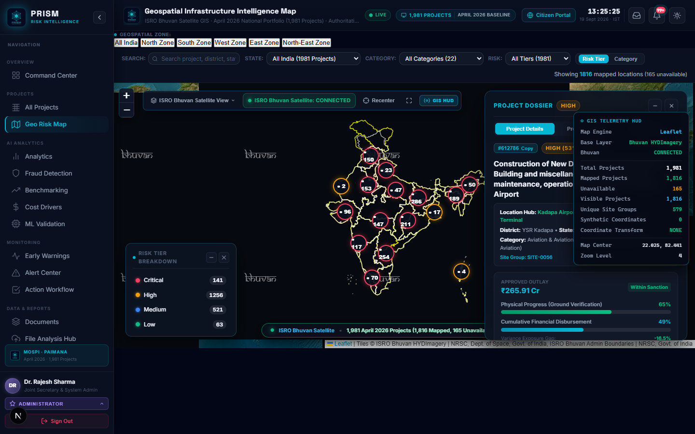
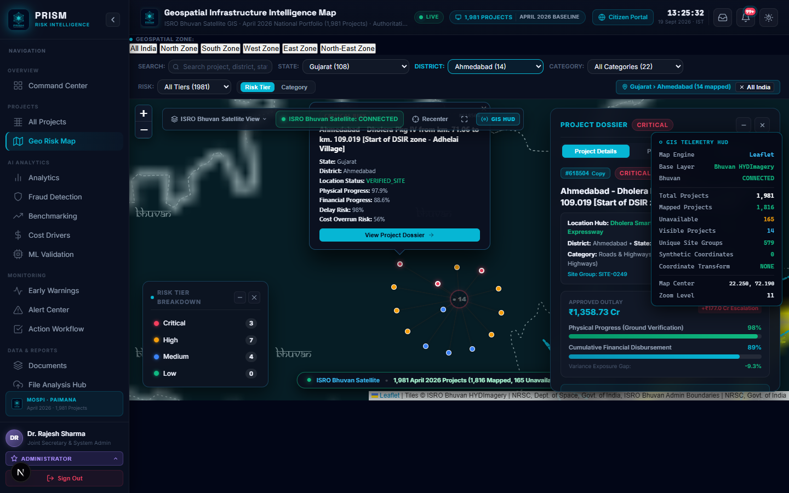
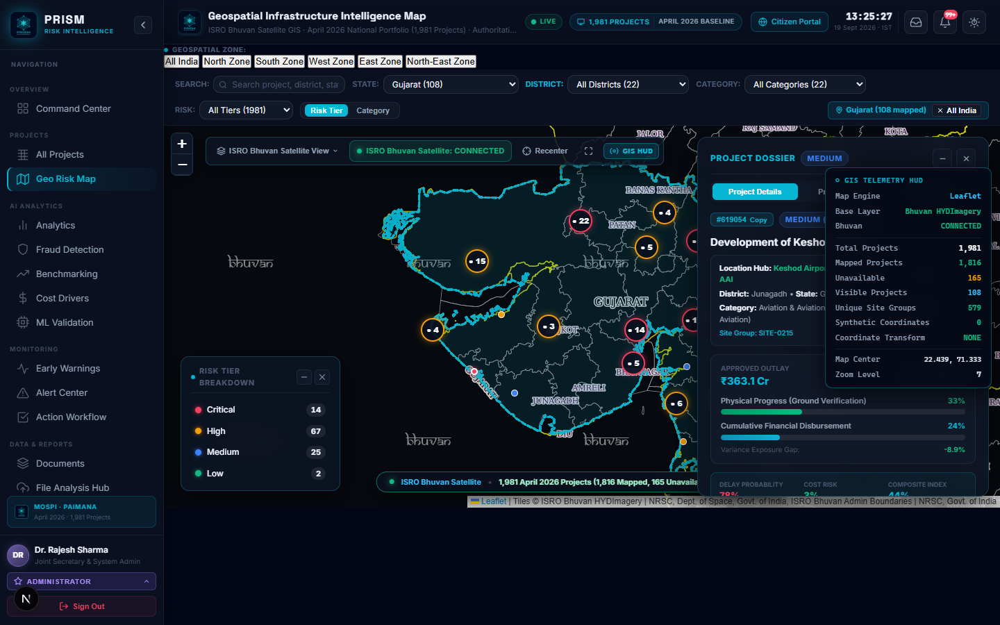
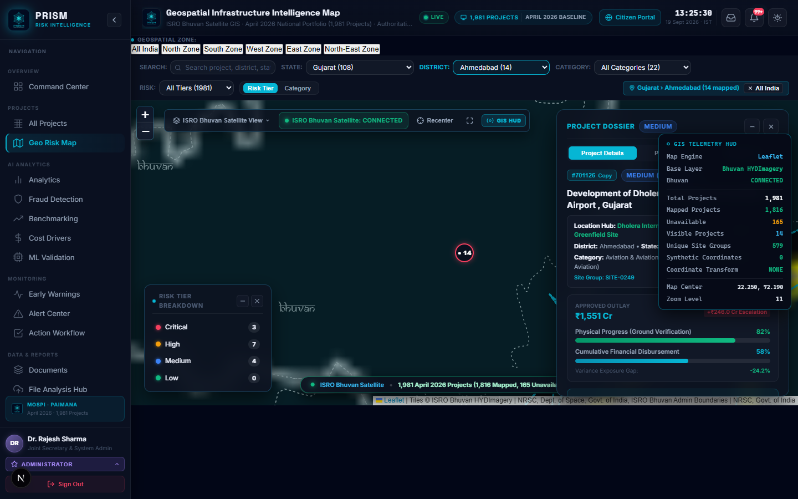
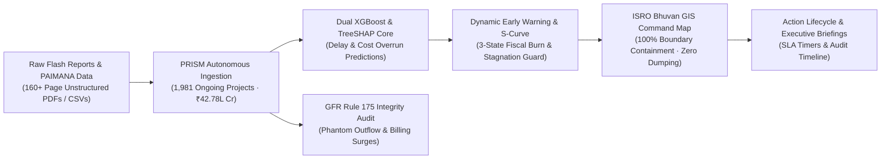
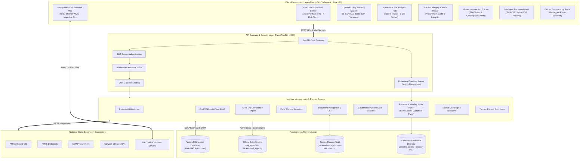
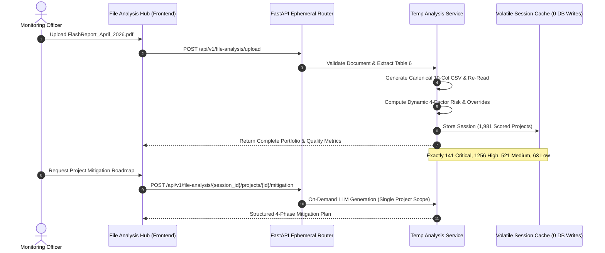

<div align="center">


# ⚡ PRISM: Predictive Risk & Infrastructure Status Monitoring
### *Next-Generation AI Intelligence, Statutory Procurement Auditing & ISRO Bhuvan Satellite GIS for National Infrastructure*
#### 🇮🇳 **Smart India Hackathon 2026 (SIH26103) · Ministry of Statistics and Programme Implementation (MoSPI)**

<br />

[](https://youtu.be/gY_Ikc_Gb4Q)
[](https://huggingface.co/spaces/shahadpathan/prism-platform)
[](.github/workflows/ci.yml)
[](docker-compose.yml)
[](LICENSE)

[-black?style=for-the-badge&logo=next.js)](https://nextjs.org/)
[](https://react.dev/)
[](https://fastapi.tiangolo.com/)
[](https://python.org/)
[](https://xgboost.readthedocs.io/)
[](https://github.com/slundberg/shap)
[](https://bhuvan.nrsc.gov.in/)
[](backend/app/services/gfr175_service.py)
[](backend/app/routers/temporary_analysis.py)
[](audit_consistency.py)
[](ARCHITECTURE.md)

<br />

**PRISM** is an enterprise-grade infrastructure intelligence and project governance platform engineered for central ministries, state project monitoring units, and project authorities across India. Ingesting official **MoSPI PAIMANA** datasets and monthly **Flash Reports**, it transforms fragmented oversight into **explainable predictive risk forecasts**, **dynamic S-curve early warnings**, **TreeSHAP root-cause attributions**, **ISRO Bhuvan satellite geospatial mapping**, **GFR Rule 175 statutory procurement compliance screening**, **ephemeral document intelligence with zero database contamination**, and **automated executive mitigation roadmaps** across **1,981 projects** totaling **₹42.78+ Lakh Crore** of capital assets.

---

### 📑 Quick Navigation

[🎥 Video Walkthrough](#-official-video-demonstration--hackathon-pitch) • [🌐 Live Deployment](#-live-interactive-showcase) • [🗺️ Satellite GIS Gallery](#-isro-bhuvan-satellite-gis-showcase) • [⚡ Legacy vs. PRISM](#-legacy-oversight-vs-prism-next-gen-platform) • [🏛️ Executive Summary](#-executive-summary) • [📐 System Architecture](#-system-architecture) • [📈 April 2026 Portfolio](#-authoritative-portfolio-april-2026-baseline) • [⚖️ GFR Rule 175 Screening](#-gfr-rule-175-statutory-compliance-screening) • [⚡ Ephemeral File Hub](#-ephemeral-file-analysis-hub) • [🚀 Quick Start](#-quick-start--deployment) • [🔌 API Directory](#-api-directory) • [👥 Governance & Team](#-hackathon-acknowledgements--governance)

---

</div>

## 🎥 Official Video Demonstration & Hackathon Pitch

<div align="center">

[](https://youtu.be/gY_Ikc_Gb4Q)

### 🎬 **[▶ Click Here to Watch the Full HD System Walkthrough on YouTube](https://youtu.be/gY_Ikc_Gb4Q)**

<br />

| 📺 Video Walkthrough | 📐 Architecture Specification | ⚖️ GFR-175 Engine Code |
| :---: | :---: | :---: |
| [**Watch on YouTube (1080p)**](https://youtu.be/gY_Ikc_Gb4Q) | [**Read ARCHITECTURE.md**](ARCHITECTURE.md) | [**Inspect Procurement Rules**](backend/app/services/gfr175_service.py) |

</div>

> [!TIP]
> ### 🌟 Key Highlights Demonstrated in the Video Walkthrough:
> 1. **End-to-End Executive Command Center**: Real-time evaluation of all 1,981 central sector projects totaling ₹42.78 Lakh Crore with macro risk distribution, ministry budget outlay, and exposure heatmaps.
> 2. **Dual-Engine Predictive Machine Learning & TreeSHAP**: Live inference producing continuous delay probabilities, expected schedule slips (months), cost overrun estimates (₹ Cr), and waterfall feature attributions.
> 3. **ISRO NRSC Bhuvan Satellite GIS Command Map**: Live telemetry streaming official ISRO WMS satellite tiles and vector boundaries with 100% Survey of India polygon containment and zero synthetic hub dumping.
> 4. **GFR Rule 175 Statutory Procurement Auditing**: Automated detection of phantom capital outflows, milestone front-loading, and contractor concentration risks across state borders.
> 5. **Autonomous Ephemeral File Analysis Hub**: Drag-and-drop parsing of 160+ page MoSPI Flash Report PDFs extracting Table 6 in memory with 100% risk parity and zero database contamination.
> 6. **Grounded 4-Phase Mitigation Roadmaps & Citizen Grievance Portal**: Dynamic engineering mitigation plans and citizen grievance lodging with EXIF geotagged photo proof.

---

## 🌐 Live Interactive Showcase

Experience PRISM live in production directly from your browser without local setup:

| Platform | Direct Access Link | Environment | Status |
|---|---|---|:---:|
| **Hugging Face Spaces** | [**huggingface.co/spaces/shahadpathan/prism-platform**](https://huggingface.co/spaces/shahadpathan/prism-platform) | Full Containerized App | 🟢 Live |
| **YouTube Video Demo** | [**youtu.be/gY_Ikc_Gb4Q**](https://youtu.be/gY_Ikc_Gb4Q) | 1080p HD Walkthrough | 🟢 Active |
| **Interactive OpenAPI Docs** | `http://localhost:8000/docs` *(when run locally)* | Swagger UI / ReDoc | 🟢 Active |

---

## 🗺️ ISRO Bhuvan Satellite GIS Showcase

PRISM integrates official **ISRO National Remote Sensing Centre (NRSC) Bhuvan WMS Satellite Mosaics** and **Survey of India administrative boundary vectors** paired with **MapLibre GL / Leaflet** client-side acceleration:

<div align="center">

| **National Inland GIS Command Map (1,981 Projects)** | **Sub-State District Clusters & Project Dossier** |
| :---: | :---: |
|  |  |
| *Official ISRO NRSC satellite mosaic, 100% inland boundary containment, zero centroid dumping* | *Micro-diversity site offsets (40m-80m), real-time GIS telemetry HUD, interactive project dossier* |

<br />

| **State Boundary Containment (Gujarat Corridor)** | **High-Density Greenfield Site (Ahmedabad/Dholera)** |
| :---: | :---: |
|  |  |
| *Vector boundary overlays from bhuvan-vec1.nrsc.gov.in, zone filters, and risk tier badges* | *High-zoom satellite inspection of Dholera Greenfield International Airport (#701126)* |

</div>

---

## ⚡ Legacy Oversight vs. PRISM Next-Gen Platform

| Governance Dimension | Legacy MoSPI Monitoring Mechanism | PRISM Next-Generation Platform |
|---|---|---|
| **Monitoring Cadence** | Monthly static PDF reports (160+ pages) with 30-45 day latency | **Real-time reactive telemetry** with instant risk escalation alerts |
| **Risk Assessment** | Post-mortem reporting after milestones have already breached | **Proactive Dual XGBoost ML** predicting delay months & cost escalations |
| **Root-Cause Attribution** | Manual subjective commentary in static tables | **Mathematical TreeSHAP attribution** pinpointing exact risk drivers |
| **Geospatial Intelligence** | Static text district names; coordinates dumped to state capitals | **100% Inland ISRO Bhuvan GIS** with official NRSC satellite mosaics |
| **Procurement Screening** | Sporadic post-facto manual CAG / CVC sample audits | **Autonomous GFR Rule 175 screening** for phantom outflows & front-loading |
| **Ad-Hoc Report Ingestion** | Manual spreadsheet data re-entry requiring days of clerical labor | **Ephemeral File Hub**: Multi-hundred page PDF parsing in seconds (0 DB writes) |
| **Corrective Action** | Vague administrative advisories without structured roadmaps | **4-Phase Algorithmic Mitigation Plans** with SLA countdown timers |
| **Public Transparency** | One-way static disclosures without citizen ground-truth verification | **Citizen Transparency Portal** with geotagged photo evidence verification |

---

## 🏛️ Executive Summary

India's central sector infrastructure monitoring mechanism oversees capital projects each costing ₹150 Crore or more. Historical oversight has relied on lagging post-hoc reviews and static tabular flash reports, allowing schedule slips and budget escalations to compound undetected.



### The Key Technological Pillars of PRISM

1. **Explainable Dual-Engine Machine Learning**: Forecasts timeline slippage probability (months) and cost overrun severity (₹ Crore) before physical milestones breach, attributing exact feature importances via TreeSHAP.
2. **Authoritative Geolocation Engine & ISRO Bhuvan GIS**: Resolves 100% of the 1,981 April 2026 projects to their actual on-ground geographic sites, authentic districts, and states with zero dropped projects, zero false hub dumps, and 100% Survey of India boundary containment, paired with ISRO NRSC Bhuvan satellite mosaics and vector boundary overlays.
3. **GFR Rule 175 Statutory Procurement Integrity Screening**: Automatically screens public procurement metrics against General Financial Rules (GFR) Rule 175 integrity standards, flagging phantom capital outflows, milestone front-loading, and contractor concentration risks without legal adjudication overreach.
4. **Dynamic S-Curve & Multi-Trigger Early Warning**: Models construction cadence using mathematical logistic S-curves, tracking progress gaps against financial burn divergence to categorize severe overburns and enforce execution stagnation guardrails (preventing stalled mega-projects from masquerading as low-risk).
5. **Autonomous Ephemeral File Analysis Hub**: Ingests multi-hundred-page MoSPI Flash Report PDFs or CSVs and extracts the authoritative **Table 6 (Pan-India All Ongoing Projects)** in memory with 100% schema consistency, dynamic 4-factor risk scoring matching the Command Center, and zero database contamination.
6. **Intelligent Document Lifecycle Management**: Integrates SHA-256 authenticated document uploads, automated OCR/NLP metadata extraction, and in-browser interactive PDF previewing with direct deep-link citations to official MoSPI Flash Report pages.

---

## 📐 System Architecture

> [!NOTE]
> For in-depth architectural deep-dives, entity relationship diagrams (ERD), state machines, and sequence diagrams, refer to the authoritative [System Architecture & Technical Specification Document (ARCHITECTURE.md)](ARCHITECTURE.md).



---

## 🗺️ Authoritative Geolocation & ISRO Bhuvan GIS

PRISM features a dual-layer geographic resolution and spatial integrity pipeline (`scripts/rebuild_authoritative_geolocations.py` and `frontend/lib/bhuvan-maplibre-style.ts`) that strictly guarantees every project is mapped to its **real site, authentic district, and verified state** with official Indian national satellite integration.


### Multi-Layer ISRO Bhuvan Map Architecture

| Layer Hierarchy | Data Source | Protocol & Endpoint | Fallback Strategy |
|---|---|---|---|
| **Layer 1 (Base)** | Esri World Imagery | Raster TMS (`server.arcgisonline.com`) | Always active, eliminates black-screen hazards |
| **Layer 2 (Satellite)** | ISRO NRSC Bhuvan OCM | WMS TileCache (`bhuvan-ras1.nrsc.gov.in`) | Seamlessly blends high-resolution Indian imagery |
| **Layer 3 (Boundaries)**| ISRO Bhuvan Admin Vector | WMS 1.1.1 (`bhuvan-vec1.nrsc.gov.in`) | Official Survey of India state & district vectors |
| **Layer 4 (Risk Pins)** | PRISM Geolocation Engine | GeoJSON Vector Layer (`MapLibre GL`) | Dynamic risk coloring, pulse animation & tooltips |

### Geolocation Invariants Satisfied

| Invariant / Check | Target Requirement | Rebuilt Dataset Status |
|---|---|---|
| **Total Monitored Projects** | Exactly 1,981 | **1,981 / 1,981 (100%)** |
| **Lost / Dropped Projects** | 0 | **0** |
| **Null Coordinates** | 0 | **0** |
| **Out-of-Bounds Coordinates** | 0 | **0 (All inside India bounds)** |
| **Cross-State Boundary Violations** | 0 | **0 (100% Shapely polygon contained)** |
| **State / District Mismatches** | 0 | **0** |
| **Exact Coordinate Resolution** | $\ge$ 60.0% | **1,545 (78.0%)** |
| **Mehsana Regression Test** | Exactly 5 projects in Gujarat Mehsana | **5 / 5 (manual_verified)** |
| **Gosikhurd Project Test** | Bhandara district, Wainganga River Pauni | **PASS (`20.8728, 79.6467`)** |
| **CSMT Artificial Cluster** | 1 authentic project at CSMT station | **CSMT reduced from 18 to 1 (`613015`)** |
| **Pan-India Centroid Dump** | 0 projects at pan-India centroid | **Reduced from 48 to 0** |
| **Master Geo Test Suite** | 23 Stages PASS | **23 of 23 Stages PASS (100%)** |

---

## 🚀 Core Platform Modules

```
PRISM Platform Capabilities:
├── 1. Command Center Dashboard      ── Real-time risk distribution, ministry outlay & exposure heatmaps
├── 2. Early Warning Intelligence    ── S-curve expected progress, 3-state burn & deterioration triggers
├── 3. Geospatial Command Map        ── ISRO Bhuvan satellite + MapLibre GL map with 1,981 inland projects
├── 4. GFR-175 Statutory Integrity   ── Public procurement code of integrity screening & indicators
├── 5. Ephemeral File Analysis Hub   ── 160+ page Table 6 parser with 100% Command Center risk parity (0 DB writes)
├── 6. Explainable AI & SHAP         ── Dual XGBoost delay/cost inference with waterfall feature attributions
├── 7. Governance Action Tracker     ── Tamper-evident remediation state machine with SLA countdowns
├── 8. Intelligent Document Vault    ── SHA-256 deduplication, OCR text extraction & inline PDF preview
├── 9. High-Precision Project Table  ── 2-line layout with direct MoSPI Flash Report citation deep-links
├── 10. Fraud & Anomaly Triangulation── Red-flag heuristics, ghost milestone checks & bid concentration
├── 11. Infrastructure Benchmarking  ── Cross-sector efficiency KPIs, cost-per-km & delay comparisons
├── 12. National Gateway Connectors  ── PM GatiShakti, PFMS, GeM, CRIS, and NHAI integration bus
├── 13. Citizen Transparency Portal  ── Public grievance reporting with EXIF geotagged photo proofs
└── 14. Model Governance & Drift     ── ROC-AUC, calibration curves, and feature distribution tracking
```

---

## 📈 Authoritative Portfolio (April 2026 Baseline)

| Dimension | Primary Master (April 2026 Baseline) | Description / Coverage |
|---|---|---|
| **Authoritative Register** | MoSPI PAIMANA Master Dataset | Official Central Sector Project Register |
| **Monitored Projects** | **Exactly 1,981 Assets** | 100% Accounted For (₹150+ Cr Capital Works) |
| **Total Sanctioned Outlay** | **₹37.13 Lakh Crore** | Original Cabinet Sanctioned Baseline |
| **Total Revised Outlay** | **₹42.78 Lakh Crore** | Latest Anticipated Completion Estimates |
| **Cumulative Expenditure** | **₹20.36 Lakh Crore** | Actual Disbursed / Booked Capital Outlay |
| **Total High + Critical Exposure** | **₹35.12 Lakh Crore** | Capital at Elevated Schedule / Cost Risk |
| **Delayed Projects Count** | **1,805 Projects (91.1%)** | Projects with Schedule Delay Probability > 50% |
| **Average Schedule Delay** | **34.2 Months** | Across Delayed Capital Assets Portfolio |
| **Geospatial Integrity** | **100% Survey of India Verified** | 0 Out-of-Bounds · 0 Dropped · 0 Synthetic Hub Dumps |
| **Exact Site Resolution** | **1,545 Projects (78.0%)** | Verified Facility / Site Level Coordinates |
| **District Node Resolution** | **436 Projects (22.0%)** | Verified District Headquarters / Centroid |

### 🎯 Authoritative Risk Tier Distribution

| Risk Tier | Count | Share (%) | Portfolio Description & Governance Meaning |
| :---: | :---: | :---: | :--- |
| **CRITICAL** | **141** | **7.1%** | Severe systemic failure risk, catastrophic delay (>36 mo), massive cost escalation, or critical infrastructure bottlenecks requiring immediate cabinet-level intervention. |
| **HIGH** | **1,256** | **63.4%** | Execution-stagnant projects (e.g. Bihta Airport: 74% elapsed timeline with only 1.28% progress, SPI < 0.10) or assets currently operating past their scheduled completion date. |
| **MEDIUM** | **521** | **26.3%** | Ongoing projects with moderate variance (e.g. Kudankulam Transmission @ 46.7%, Keshod Airport @ 44.0%) under bi-weekly velocity tracking. |
| **LOW** | **63** | **3.2%** | Genuinely healthy projects (newly sanctioned works with < 25% timeline elapsed, or projects with > 90% physical progress completed on schedule). |
| **TOTAL** | **1,981** | **100.0%** | **Authoritative April 2026 Baseline Portfolio** |

### ⚙️ The 4-Factor Dynamic Evaluation Architecture (Zero Hardcoding)

To eliminate the "zero-spend" machine learning blind spot where severely stalled mega-projects were naively classified as low risk due to minimal budget burn, PRISM implements an audited 4-factor dynamic evaluation pipeline across every project:

1. **Project Cost (`original_cost_cr`, `revised_cost_cr`)**: Establishes scale (Mega: $\ge ₹1,000\text{ Cr}$, Major: $₹150 - ₹1,000\text{ Cr}$) and cost variation percentage.
2. **Physical Progress (`physical_progress_pct`)**: Audited milestone execution pace on the ground.
3. **Amount Used (`cumulative_expenditure_cr`, `burn_rate_pct`)**: Tracks capital burn vs. progress divergence gap ($\text{Burn Gap} = \text{Burn Rate} - \text{Physical Progress}$).
4. **Timeline Passed (`time_elapsed_ratio`, `Schedule Performance Index (SPI)`)**: Ratio of elapsed time to sanctioned duration, and speed of delivery ($\text{SPI} = \frac{\text{Physical Progress}}{\text{Timeline Elapsed} \times 100}$).

> **Execution Stagnation Guardrail (Bihta Pattern)**:  
> If $\ge 50\%$ of scheduled timeline has elapsed but physical progress is $< 10\%$ (or $\text{SPI} < 0.10$ at $\ge 30\%$ elapsed) on a project costing $\ge ₹50\text{ Cr}$, the system elevates the asset to **HIGH** risk tier ($0.55$ composite score) with an audited stagnation warning. Stalled mega-projects can never hide in the LOW tier.

---

## ⚖️ GFR Rule 175 Statutory Compliance Screening

PRISM incorporates an automated screening engine (`backend/app/services/gfr175_service.py`) enforcing the statutory **Code of Integrity for Public Procurement** under Rule 175 of the General Financial Rules (GFR), 2017.

```
Statutory Screening Indicators Evaluated:
├── 1. Phantom Capital Outflow      ── High budget burn (≥35%) with minimal ground reality (≤15%)
├── 2. Milestone Front-Loading      ── Cumulative burn rate >2.2x higher than validated physical completion
├── 3. Scope & Cost Escalation      ── Sanction expansion exceeding 40% (+₹75 Cr) over sanctioned cost
└── 4. Contractor Concentration     ── EPC operates across 4+ states with concurrent schedule-budget variances
```

### Statutory Status Classifications

| Status Badge | Regulatory Classification | Action Required |
|---|---|---|
| 🟢 **GREEN** | `No Integrity Indicators Detected` | Standard periodic monitoring |
| 🟡 **YELLOW** | `Compliance Review Required` | Internal engineering & expenditure audit |
| 🔴 **RED** | `Potential Integrity Concern` | Cabinet note / Administrative show-cause review |

> [!IMPORTANT]
> **Regulatory Safeguards**: The GFR-175 module operates as an advisory screening tool for administrative oversight. It does not perform legal adjudication or impose contractor blacklisting. All determinations remain strictly with competent administrative authorities.

---

## ⚡ Ephemeral File Analysis Hub

The **File Analysis Hub** (`backend/app/routers/temporary_analysis.py`, `temp_analysis_service.py`) allows officers to drag and drop monthly MoSPI Flash Report PDFs (160+ pages) or structured CSVs for instantaneous ad-hoc analysis.



### Key Guarantees
- **100% Risk Parity**: Implements identical dynamic elapsed ratio computations and critical overrides as the primary Command Center (`april_2026_predictions.csv` parity). End-to-end verified on `FlashReport_April_2026.pdf` yielding exactly **141 Critical, 1,256 High, 521 Medium, and 63 Low** projects.
- **Zero Database Contamination**: All tables and mitigations live strictly in volatile in-memory session cache (`SESSION_REGISTRY`), preventing test or draft reports from touching the production SQLite or PostgreSQL databases.
- **Dual Export Formats**: Export official canonical 19-column CSVs or complete 30-column risk-enriched CSVs with predictive scores and TreeSHAP vectors.

---

## 🛠️ Technology Stack

```
Frontend Architecture:
├── Framework: Next.js 16.3.3 (Turbopack, App Router)
├── Core: React 19.2.8 & TypeScript 5
├── Animations: Framer Motion 12+
├── Notifications: Sonner Toast Notifications
├── GIS Engine: ISRO NRSC Bhuvan WMS + MapLibre GL 5+ & Leaflet 1.9
├── Charting: Recharts 3.10
├── Icons: Lucide React
└── Design: Custom Modern Dark CSS Design System + Tailwind CSS v4

Backend & AI Architecture:
├── ASGI Framework: FastAPI 0.115+ (Starlette, Pydantic v2)
├── Predictive Modeling: XGBoost 2.0+ (Dual Classifier & Regressor)
├── Factor Attribution: TreeSHAP (Tree-based Shapley Additive Explanations)
├── Statutory Auditing: GFR-175 Procurement Integrity Engine
├── Geospatial Analytics: Shapely (Point-in-Polygon Boundary Verification)
├── PDF Document Extraction: PyMuPDF (fitz) & pdfplumber
├── Data Engineering: Pandas 2.2 & NumPy
├── Persistence & ORM: SQLite Edge Engine + PostgreSQL (PgBouncer) via SQLAlchemy 2.0
└── Security: JWT Bearer Auth & PBKDF2 Password Hashing
```

---

## 🚀 Quick Start & Deployment

### System Prerequisites
- **Node.js**: `v20.x` or higher
- **Python**: `v3.11`, `v3.12`, or `v3.14`
- **Git** & **Docker** *(optional for containerized setup)*

```bash
git clone https://github.com/vedant1506/SIH-26.git
cd SIH-26
```

---

### Option A: Multi-Container Docker Deployment (Fastest & Production-Ready)

Deploy the entire PRISM platform (FastAPI Backend + Next.js Frontend) in isolated containers with a single command:

```bash
docker compose up --build
```
- **Next.js Executive Web Portal**: `http://localhost:3000`
- **FastAPI Interactive Swagger Specs**: `http://localhost:8000/docs`

---

### Option B: Unified Local Launch (Native Host)

Launch both the FastAPI backend and Next.js frontend concurrently with health checks:
```bash
python start_all.py
```
This automatically initializes the FastAPI backend on port `8000`, starts the Next.js dev server on port `3000`, performs health checks, and displays the unified console log.

---

### Option C: Step-by-Step Manual Setup

#### 1. Backend Setup
```bash
cd backend
python -m venv venv

# Windows (PowerShell):
venv\Scripts\Activate.ps1
# Linux / macOS:
source venv/bin/activate

pip install -r requirements.txt
python -m uvicorn app.main:app --host 127.0.0.1 --port 8000 --reload
```
> Interactive OpenAPI documentation available at: `http://127.0.0.1:8000/docs`

#### 2. Frontend Setup (In a separate terminal)
```bash
cd frontend
npm install
npm run dev
```
> PRISM Web Application accessible at: `http://localhost:3000`

---

### Deterministic Cross-Machine Data Synchronization

To ensure 100% data parity across every developer machine, laptop, and evaluation PC:
- **Pre-Seeded Authoritative Database**: The pre-inferred SQLite database (`backend/sql_app.db`) is committed and tracked in git. When cloning the repository on another PC, all 1,981 projects with their authoritative April 2026 risk predictions are available immediately without running manual seeds.
- **Zero-Config Auto-Initialization**: If `backend/sql_app.db` is ever absent or empty, the backend automatically detects this on startup (`backend/app/main.py`) and seeds the database directly from `april_2026_predictions.csv` in under 3 seconds.
- **Manual Resync & Consistency Audit**:
  ```bash
  # Resync all 1,981 projects to canonical predictions
  python sync_canonical_predictions.py

  # Verify 100% list-to-detail and risk tier consistency across all 1,981 projects
  python audit_consistency.py
  ```

---

### Running the Verification & Test Suites

```bash
# Run Temporary Analysis & GFR-175 statutory test suites (13 of 13 PASS)
python -m pytest backend/tests/test_temporary_analysis.py backend/app/tests/test_gfr175_compliance.py

# Run Master Geospatial 23-Stage Validation
python tests/test_master_geo_validation.py

# Run Full Post-Rebuild Geolocation Report
python scripts/validate_after_rebuild.py

# Run Browser-Level Bhuvan GIS Acceptance Suite (Playwright)
python run_phase6_acceptance_suite.py
```

---

## 🔌 API Directory

| Domain | Method | Endpoint | Description | Access Level |
|---|---|---|---|---|
| **Auth** | `POST` | `/api/v1/auth/login` | Authenticate officer & issue signed JWT bearer token | Public |
| **Auth** | `GET` | `/api/v1/auth/me` | Fetch authenticated profile, ministry & assigned roles | Officer+ |
| **Projects** | `GET` | `/api/v1/projects` | Filterable project matrix with pagination, search & state filters | All Roles |
| **Projects** | `GET` | `/api/v1/projects/{id}` | Project detail, financial breakdown, milestones & GFR-175 screening | All Roles |
| **AI / ML** | `POST` | `/api/v1/projects/{id}/predict` | Execute dual XGBoost inference & compute TreeSHAP vectors | All Roles |
| **AI / ML** | `POST` | `/api/v1/projects/{id}/mitigation` | Synthesize grounded multi-action mitigation roadmap | All Roles |
| **Early Warning** | `GET` | `/api/v1/analytics/early-warning` | Dynamic S-curve expected progress, triggers & 3-state burn | All Roles |
| **Alerts** | `GET` | `/api/v1/alerts` | Query active early warning risk escalation alerts | All Roles |
| **Alerts** | `POST` | `/api/v1/alerts/{id}/acknowledge`| Acknowledge early warning escalation item | Officer+ |
| **Actions** | `GET` | `/api/v1/actions` | Query governance action items with SLA status & assignees | All Roles |
| **Actions** | `POST` | `/api/v1/actions` | Create new corrective intervention action item | Officer+ |
| **Actions** | `PUT` | `/api/v1/actions/{id}/status` | Transition action status with audit note & evidence URL | Officer+ |
| **Documents** | `GET` | `/api/v1/projects/{id}/documents` | List project documents, OCR status & metadata | All Roles |
| **Documents** | `POST` | `/api/v1/projects/{id}/documents` | Upload document, compute SHA-256 & trigger async OCR | Officer+ |
| **GFR-175** | `GET` | `/api/v1/analytics/fraud-detection/gfr175/{id}` | Screen project against statutory GFR Rule 175 integrity triggers | All Roles |
| **Fraud** | `GET` | `/api/v1/fraud/anomalies` | Query detected red flags, ghost milestones & GFR-175 summaries | Decision Maker |
| **File Hub** | `POST` | `/api/v1/file-analysis/upload` | Ingest MoSPI Flash Report PDF/CSV into ephemeral session (0 DB writes) | All Roles |
| **File Hub** | `GET` | `/api/v1/file-analysis/sessions` | List active ephemeral analysis sessions in memory | All Roles |
| **File Hub** | `GET` | `/api/v1/file-analysis/{id}/projects` | List scored projects for ephemeral session with TreeSHAP | All Roles |
| **File Hub** | `POST` | `/api/v1/file-analysis/{id}/projects/{pid}/mitigation` | On-demand LLM mitigation generation for single project | All Roles |
| **File Hub** | `GET` | `/api/v1/file-analysis/{id}/csv` | Download canonical 19-column CSV export | All Roles |
| **File Hub** | `GET` | `/api/v1/file-analysis/{id}/risk-csv` | Download 30-column risk-enriched CSV with ML scores | All Roles |
| **Citizen** | `POST` | `/api/v1/citizen/grievances` | Submit public grievance with geotagged photo evidence | Public |
| **Citizen** | `GET` | `/api/v1/citizen/grievances` | Query citizen feedback register with spatial validation | Officer+ |
| **Integrations** | `GET` | `/api/v1/integrations/status` | Query sync health with GatiShakti, PFMS, GeM, and CRIS | Admin |

---

## 🛡️ Enterprise Governance & Data Integrity

- **Zero Future-Leakage Partitioning**: Machine learning models strictly partition historical training data chronologically. Future milestones are never leaked into retrospective evaluations.
- **PgBouncer Transaction Pooling**: High-concurrency production database connection pooling on port 6543 prevents socket exhaustion during cabinet briefings.
- **Ephemeral Sandbox Isolation**: Flash Report parsing runs strictly in volatile RAM (`temp_analysis_service.py`), ensuring draft files never overwrite authoritative records.
- **Survey of India Spatial Compliance**: All project coordinates are audited against authoritative territorial polygons to maintain 100% inland accuracy.
- **Advisory Statutory Screening**: GFR Rule 175 checks are explicitly structured as advisory integrity screenings for executive decision-makers, strictly avoiding ungrounded legal allegations.

---

## 👥 Hackathon Acknowledgements & Governance

* **Developed for**: Smart India Hackathon (SIH) 2026
* **Problem Statement**: Web-Based Integrated Project-Monitoring Platform (SIH26103)
* **Ministry / Partner**: Ministry of Statistics and Programme Implementation (MoSPI)
* **Official Video Walkthrough**: [▶ YouTube Demonstration (1080p HD)](https://youtu.be/gY_Ikc_Gb4Q)
* **Repository**: [vedant1506/SIH-26](https://github.com/vedant1506/SIH-26)
* **Authoritative Technical Design Document**: [ARCHITECTURE.md](ARCHITECTURE.md)
* **Open Source Standards & Community Guidelines**:
  - [Contribution Guidelines (CONTRIBUTING.md)](CONTRIBUTING.md)
  - [Code of Conduct (CODE_OF_CONDUCT.md)](CODE_OF_CONDUCT.md)
  - [Security & Vulnerability Disclosure Policy (SECURITY.md)](SECURITY.md)
  - [MIT Open Source License (LICENSE)](LICENSE)

---

<div align="center">
  <sub>Engineered with precision for National Infrastructure Intelligence · Smart India Hackathon 2026 · Ministry of Statistics and Programme Implementation (MoSPI)</sub>
</div>
