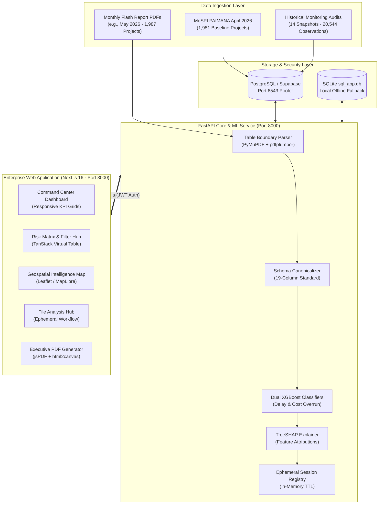

<div align="center">

# ⚡ PRISM: Predictive Risk & Infrastructure Status Monitoring
### *Next-Generation AI Intelligence & Geospatial Analytics Platform for National Infrastructure*

[-black?style=for-the-badge&logo=next.js)](https://nextjs.org/)
[](https://react.dev/)
[](https://fastapi.tiangolo.com/)
[](https://python.org/)
[](https://xgboost.readthedocs.io/)
[](https://github.com/slundberg/shap)
[](https://leafletjs.com/)
[](https://sih.gov.in/)

<br />

**PRISM** is an enterprise-grade, market-ready infrastructure intelligence platform engineered for government ministries, state departments, and infrastructure authorities. It ingests official **Ministry of Statistics and Programme Implementation (MoSPI) PAIMANA** datasets and monthly **Flash Reports**, transforming fragmented data into **explainable predictive risk forecasts**, **TreeSHAP root-cause attributions**, **interactive geospatial mapping**, and **automated executive mitigation roadmaps**.

[Executive Summary](#-executive-summary) • [Key Capabilities](#-key-capabilities) • [System Architecture](#-system-architecture) • [Live Demonstration Portfolio](#-live-demonstration-portfolio) • [Quick Start](#-quick-start) • [API Reference](#-api-reference)

</div>

---

## 🏛️ Executive Summary

India's central sector infrastructure program monitors projects each costing ₹150 Crore or more, spanning an outlay exceeding **₹42.78 Lakh Crore**. Historical oversight has relied on lagging quarterly reviews and manual tabular reports, leading to compounded schedule delays and undetected budget escalations.

**PRISM resolves this paradigm through four technological pillars:**
1. **Explainable Dual-Engine Machine Learning**: Predicts both schedule delay probability and cost overrun severity before physical milestones slip, explaining every inference with TreeSHAP feature attributions.
2. **Autonomous Ephemeral Document Extraction**: Ingests multi-hundred-page official MoSPI Flash Report PDFs (160+ pages) and parses the authoritative **Table 6 (Pan-India All Ongoing Projects)** in under 40 seconds with zero manual configuration and 100% schema integrity.
3. **High-Precision Geospatial Intelligence**: Maps central infrastructure assets with inland coordinate validation across Indian states, districts, and union territories.
4. **Actionable AI Mitigation Synthesizer**: Converts predictive risk factors and financial variances into grounded, multi-horizon intervention strategies with instant exportable executive PDF briefings.

---

## 🚀 Key Capabilities

### 1. 📊 Executive Command Center
- **Real-Time Risk Tiers**: Categorizes central sector portfolios into **Critical**, **High**, **Medium**, and **Low** risk tiers based on composite predictive scoring.
- **Exposure Analytics**: Quantifies total financial outlay at risk across 17+ central ministries and 22+ key economic sectors (Highways, Railways, Power, Petroleum, Ports, Jal Shakti).
- **Responsive Layout Architecture**: Optimized for high-resolution command-center displays, tablet briefing monitors, and mobile smartphones with slide-out drawer navigation and fluid CSS grid breakpoints.

### 2. 🤖 Explainable AI & Predictive Modeling
- **Dual XGBoost Classifier**:
  - *Schedule Delay Model*: Predicts timeline slippage probability and duration in months using operational burn gap, milestone progress drift, and scale ratios.
  - *Cost Overrun Model*: Forecasts capital expenditure variations against sanctioned expenditure limits.
- **TreeSHAP Explainability**: Replaces black-box guessing with quantified positive and negative factor contributions for every project (e.g. *Budget spent 35% faster than physical progress*, *Land acquisition milestone overdue by 64 days*).
- **Interactive What-If Simulation Sandbox**: Allows project directors to stress-test budget adjustments, milestone accelerations, and contractor performance to simulate risk-reduction scenarios in real time.

### 3. 📂 File Analysis Hub (Ephemeral Intelligence)
- **Authoritative Table 6 Isolation**: Proprietary multi-pass table boundary parser that skips summary sheets and regional sub-tables to isolate the Pan-India All Ongoing Projects master register.
- **Stacked Dual-Cost Parsing**: Automatically splits and normalizes complex dual-cost cells (`Original Cost\nRevised Cost`) without accounting-negative inversions.
- **Zero Database Contamination**: Ephemeral 2-hour session memory guarantees that ad-hoc uploads and test datasets never overwrite the central reference database or corrupt historical tracking.
- **Canonical 19-Column CSV Export**: Verified round-trip CSV generator that matches MoSPI schema specifications with sequential Sl.No continuity.

### 4. 🗺️ Geospatial Risk Map
- **100% Inland Spatial Validation**: Verified spatial integrity ensuring zero coordinates drift into marine zones or foreign territories.
- **Multi-Level Granularity**: Filter by State, District, Sector, or Risk Tier with instant heatmap clusters, choropleth state boundaries, and pin-level project drilldowns.
- **Dual Thematic Modes**: Switch dynamically between **Risk Tier Visualization** (Critical/High/Medium/Low) and **Sector Infrastructure Distribution** (Highways, Railways, Power, Coal, Petroleum).

### 5. 📑 Grounded AI Mitigation Roadmaps
- **Immediate Intervention Protocol**: Identifies high-leverage immediate actions (7-14 day horizon) and follow-up milestones (30-90 day horizon).
- **Printable Executive Briefings**: One-click professional PDF generation incorporating MoSPI reference codes, risk indices, SHAP factor rankings, and administrative recommendations.

---

## 📐 System Architecture



---

## 📈 Live Demonstration Portfolio

PRISM is pre-calibrated against verified government infrastructure reports:

| Metric | Primary Dataset (April 2026) | Flash Report (May 2026) | Flash Report (July 2026) | Historical Pipeline |
|---|---|---|---|---|
| **Authoritative Register** | MoSPI PAIMANA Master | Table 6: All Ongoing | Table 6: All Ongoing | 14 Historical Audits |
| **Monitored Projects** | **Exactly 1,981** | **Exactly 1,987** | **Exactly 1,775** | **20,544 Records** |
| **Total Capital Outlay** | **₹42.78 Lakh Crore** | **₹37.10 Lakh Crore** | **₹34.49 Lakh Crore** | Longitudinal (2025–2026) |
| **Critical Risk Projects** | 140 Projects | 108 Projects | 97 Projects | Continuously Assessed |
| **Delayed Trajectory** | 1,805 Projects (>50% prob) | 1,768 Projects | 1,592 Projects | Validated vs Slippage |
| **False-Positive Drops** | **0** | **0** | **0** | **0** |
| **Database Contamination** | 0 Writes on Upload | 0 Writes on Upload | 0 Writes on Upload | Immutable Master Baseline |

---

## 🛠️ Technology Stack

```
Frontend:
├── Framework: Next.js 16.3.3 (Turbopack, App Router)
├── Core: React 19.2.8 & TypeScript 5
├── Animations & Physics: Framer Motion 12+
├── Notifications: Sonner (Enterprise Toasts)
├── GIS & Mapping: Leaflet 1.9 & MapLibre GL
├── Visualizations: Recharts 3.10
├── Icons: Lucide React
└── Styling: Custom CSS Design System + Tailwind CSS v4

Backend & AI Layer:
├── Server Framework: FastAPI 0.115+ (ASGI, Starlette)
├── Machine Learning: XGBoost 2.0+ (Dual Delay/Cost Classifiers)
├── Explainability: TreeSHAP (Additive Feature Attributions)
├── PDF Document Extraction: PyMuPDF (fitz) & pdfplumber
├── Data Engineering: Pandas 2.2 & NumPy
├── ORM & Persistence: SQLAlchemy 2.0 & Pydantic v2
└── Security: JWT Bearer Authentication & PBKDF2 Password Hashing
```

---

## 🏁 Quick Start

### Prerequisites
- **Node.js**: `v20.x` or higher
- **Python**: `v3.11` or `v3.12`
- **Git**

### 1. Clone Repository
```bash
git clone https://github.com/vedant1506/SIH-26.git
cd SIH-26
```

### 2. Backend Setup
```bash
cd backend
python -m venv venv

# Activate Virtual Environment:
# Windows (PowerShell):
venv\Scripts\Activate.ps1
# Linux / macOS:
source venv/bin/activate

pip install -r requirements.txt
python -m uvicorn app.main:app --host 127.0.0.1 --port 8000 --reload
```
> Interactive OpenAPI documentation available at: `http://127.0.0.1:8000/docs`

### 3. Frontend Setup (In a separate terminal)
```bash
cd frontend
npm install
npm run dev
```
> Web Application accessible at: `http://localhost:3000`

---

## 🔌 API Reference (FastAPI Endpoints)

| Method | Endpoint | Description | Role / Auth |
|---|---|---|---|
| `POST` | `/api/v1/auth/login` | Authenticate user & issue JWT bearer token | Public |
| `GET` | `/api/v1/auth/me` | Fetch authenticated officer profile & roles | Officer+ |
| `GET` | `/api/v1/projects` | Filterable project matrix with pagination & search | All Roles |
| `GET` | `/api/v1/projects/{id}` | Project detail, financial breakdown & milestone history | All Roles |
| `POST` | `/api/v1/projects/{id}/predict` | Execute dual XGBoost inference & compute TreeSHAP vectors | All Roles |
| `POST` | `/api/v1/projects/{id}/mitigation` | Synthesize grounded multi-action mitigation roadmap | All Roles |
| `GET` | `/api/v1/alerts` | Query active early warning risk escalation alerts | All Roles |
| `POST` | `/api/v1/alerts/{id}/acknowledge`| Acknowledge early warning escalation item | Officer+ |
| `GET` | `/api/v1/projects/analytics/portfolio`| Aggregate portfolio KPI metrics, variance & distributions | Decision Maker |
| `POST` | `/api/v1/temporary-analysis/upload` | Ingest MoSPI Flash Report PDF/CSV into ephemeral session | Ephemeral |
| `GET` | `/api/v1/temporary-analysis/{id}/csv` | Download verified canonical 19-column CSV export | Ephemeral |
| `DELETE` | `/api/v1/temporary-analysis/{id}` | Terminate ephemeral session and release memory | Ephemeral |

---

## 🛡️ Enterprise Data Quality & Security Safeguards

- **Zero Future-Leakage Guarantee**: ML training strictly partitions historical data chronologically. Snapshot horizons never use future milestones to predict retrospective outcomes.
- **Port 6543 Transaction Pooling**: Production database connections utilize connection pooling to prevent socket exhaustion during concurrent dashboard usage.
- **Ephemeral Sandbox Isolation**: File Analysis uploads process entirely in memory (`temp_analysis_service.py`), ensuring that draft reports never overwrite verified database records.
- **Coordinate Boundary Enforcers**: All geographic latitude/longitude data points are audited against the Survey of India territorial polygon bounding boxes.

---

## 👥 Core Team & SIH Acknowledgements

* **Developed for**: Smart India Hackathon (SIH) 2026
* **Problem Statement**: Web-Based Integrated Project-Monitoring Platform (SIH26103)
* **Ministry / Organization**: Ministry of Statistics and Programme Implementation (MoSPI)
* **Repository**: [vedant1506/SIH-26](https://github.com/vedant1506/SIH-26)

---

<div align="center">
  <sub>Engineered with precision for National Infrastructure Intelligence · Smart India Hackathon 2026</sub>
</div>
